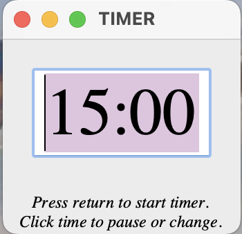

# A Simple Timer 
- This is a simple timer, written in two different languages: Python and Tcl.  Both use Tk.  The ".app" files in the Python and TclTk folders should run on a Mac.

- To start the timer, type a time (in minutes and seconds) into the window, and press return.
- When the timer runs out, it will ring a bell (on a Mac with /usr/bin/afplay installed) or beep three times.
- To pause the timer, click on the time remaining. Press return to start it again.

